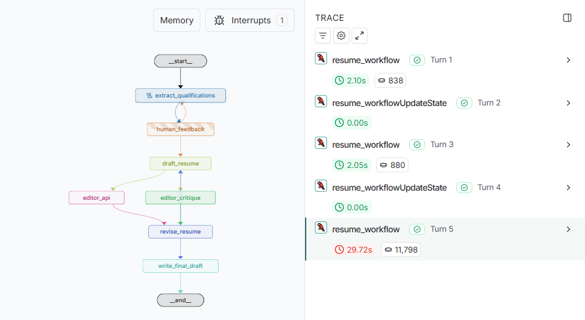

# Automated Resume Writer with LangGraph  

## Project Description  
This project demonstrates how to build an **agentic workflow** for automatic resume drafting and editing using **LangGraph**.  

### Features  
- **Qualification Extraction Subgraph**  
  - Parses job postings to extract required qualifications.  
  - Human-in-the-loop correction to ensure accuracy.  
  - Loops until the user approves the qualification list.  

- **Resume Drafting**  
  - Generates a tailored draft based on the user’s existing CV.  

- **Editor Feedback**  
  - Editor A: Provides basic critique.  
  - Editor B: Planned integration with Jobgether & GPTZero APIs (temporarily omitted).  
  - Loops editor feedback up to 2 rounds before finalizing the resume.  

- **LangGraph Studio Integration**  
  - Enables smooth user interaction for feedback and approvals.  
  - Full execution is documented in five publicly available **LangSmith prompt traces** (links to be added). 



---

## Requirements  
- **Python 3.11**  
- All dependencies are listed in `requirements.txt` at the root directory.  
  Install them with:  

```bash
pip install -r requirements.txt
```


